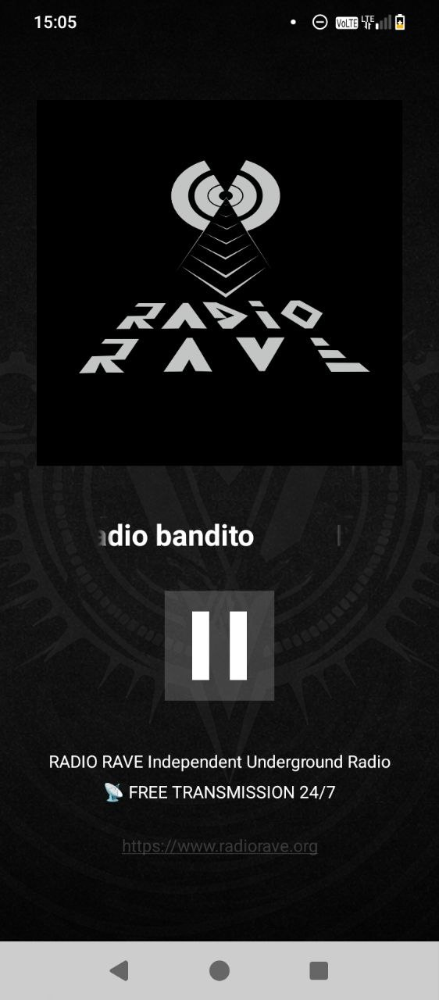

#  Radio Rave Android Native app

This is a simple app using a background service to play an audio stream and a de-coupled UX interacting with the service. Metadata about the track being played is polled from a web API every 30 seconds.

Current requirements are: minimum OS: Android 6. Besides tablets and phones, it have been tested and should also work fine on Amazon Kindle, Amazon Fire TV, Android TV, Google TV (including the new Chromecast).

Radio website: https://radiorave.org

References about the architecture/patterns followed:
- https://developer.android.com/media/media3/session/background-playback
- https://medium.com/@janand1991/background-audio-playback-in-android-using-mediasessionservice-jetpack-compose-88214b02266d
- https://medium.com/@debz_exe/implementation-of-media-3-mastering-background-playback-with-mediasessionservice-and-5e130272c39e

